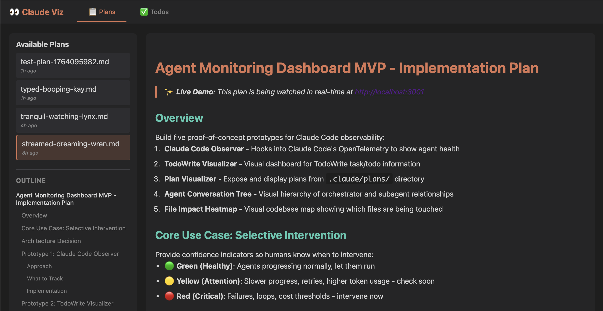
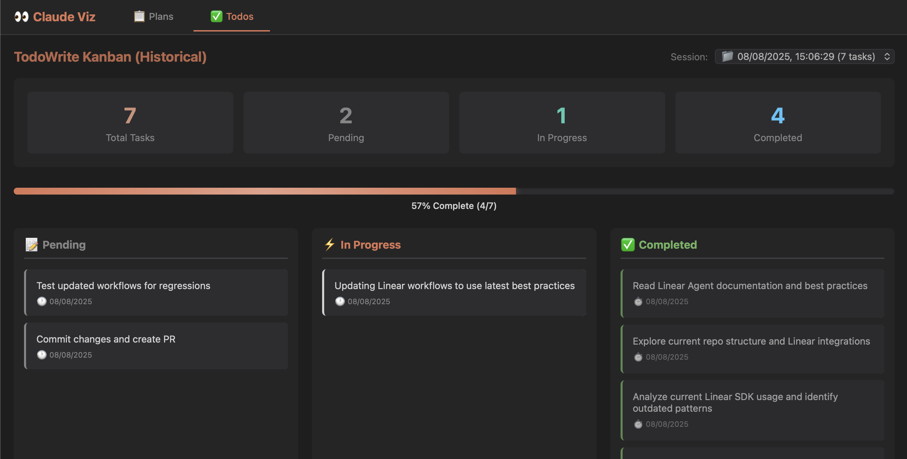

# Claude Viz

Live web dashboards for monitoring Claude Code's planning and task tracking in real-time.





## Quick Start

```bash
# View unified dashboard with both tools
npx claude-viz

# Open directly to Plans tab
npx claude-viz plan

# Open directly to Todos tab
npx claude-viz todo
```

## What's Included

Single unified web app with two tabs:

### Plans Tab 📋
- **Watches:** `~/.claude/plans/*.md`
- **Features:**
  - Live markdown rendering with syntax highlighting
  - Real-time updates via Server-Sent Events
  - Sidebar to navigate available plans
  - Outline to navigate sections within a plan

### Todos Tab ✅
- **Watches:** `~/.claude/todos/*.json`
- **Features:**
  - Kanban board view (Pending → In Progress → Completed)
  - Real-time task updates
  - Visual progress tracking with statistics
  - Session history viewer

## Installation

### No Installation Required (npx)
```bash
npx claude-viz
```

### Global Installation (Optional)
```bash
npm install -g claude-viz
claude-viz              # Unified dashboard
claude-viz plan         # Focus on Plans
claude-viz todo         # Focus on Todos
```

## Configuration

### Port Configuration

**Default port:** 8888

**Using --port flag:**
```bash
npx claude-viz --port 3000
```

**Using PORT environment variable:**
```bash
PORT=3000 npx claude-viz
```

### Custom Directories

The visualizers automatically watch:
- Plans: `~/.claude/plans/`
- Todos: `~/.claude/todos/`

These are the default directories used by Claude Code.

## Requirements

- **Node.js:** 18.0.0 or higher
- **Claude Code:** Must be installed and running to generate files

## How It Works

Claude Code Visualizers runs a lightweight Express server that:

1. **Watches File Directories:** Uses `chokidar` to monitor `~/.claude/plans/` and `~/.claude/todos/`
2. **Parses Content:** Converts markdown plans to HTML and structures todo JSON data
3. **Streams Updates:** Broadcasts changes to browser via Server-Sent Events (SSE)
4. **Unified UI:** Serves a tabbed interface for seamless switching between visualizers

### Architecture

```
┌─────────────────┐
│   Browser UI    │
│  (Tabs: Plans   │
│   and Todos)    │
└────────┬────────┘
         │ SSE Stream
         │
┌────────▼────────┐
│  Express Server │
│   (Port 8888)   │
└────────┬────────┘
         │
    ┌────┴────┐
    │         │
┌───▼──┐  ┌──▼───┐
│ Plan │  │ Todo │
│Watch │  │Watch │
│  er  │  │  er  │
└───┬──┘  └──┬───┘
    │        │
    │        │
┌───▼────────▼───┐
│ ~/.claude/     │
│ ├─ plans/      │
│ └─ todos/      │
└────────────────┘
```

## Usage Examples

### Basic Usage
```bash
# Start with default settings (port 8888, unified dashboard)
npx claude-viz
```

### Focus on Specific Tab
```bash
# Open directly to Plans view
npx claude-viz plan

# Open directly to Todos Kanban board
npx claude-viz todo
```

### Custom Port
```bash
# Use port 3000 instead of default 8888
npx claude-viz --port 3000

# Or with environment variable
PORT=9999 npx claude-viz
```

### View Historical Sessions
The Todos tab includes a session selector dropdown:
- Select "Live" to watch current Claude Code session
- Select archived sessions to review past todo lists
- Sessions are auto-filtered (keeps last 30 with activity)

## Troubleshooting

### Port Already in Use
**Error:** `EADDRINUSE: address already in use`

**Solution:** Use a different port
```bash
npx claude-viz --port 3000
```

### No Plans/Todos Showing
**Issue:** Visualizers show empty state

**Solutions:**
1. Ensure Claude Code is running and has created files in `~/.claude/`
2. Check directory exists: `ls ~/.claude/plans/` and `ls ~/.claude/todos/`
3. Trigger plan mode or use TodoWrite in Claude Code to generate files

### Browser Doesn't Auto-Open
**Issue:** CLI starts but browser doesn't open

**Solution:** Manually open the URL shown in terminal:
```
http://localhost:8888
```

### Permission Errors
**Issue:** Cannot read `~/.claude/` directories

**Solution:** Ensure your user has read permissions:
```bash
ls -la ~/.claude/
```

## Development

### Local Development
```bash
# Clone the repository
git clone git@github.com:sparkmints/claude-viz.git
cd claude-viz

# Install dependencies
npm install

# Build TypeScript
npm run build

# Run locally
npm run dev

# Or test the built version
node dist/cli.js
```

### Project Structure
```
claude-viz/
├── src/
│   ├── cli.ts               # CLI entry point with arg parsing
│   ├── server.ts            # Unified Express server
│   ├── types.ts             # TypeScript type definitions
│   ├── watchers/
│   │   ├── plan-watcher.ts  # Plans file watcher
│   │   └── todo-watcher.ts  # Todos file watcher
│   ├── parsers/
│   │   └── markdown.ts      # Markdown to HTML parser
│   └── public/              # Static frontend assets
├── screenshots/             # README images
├── dist/                    # Compiled JavaScript
├── package.json
├── tsconfig.json
└── README.md
```

## Tech Stack

- **Runtime:** Node.js 18+
- **Framework:** Express.js
- **File Watching:** Chokidar
- **Markdown Parsing:** Marked
- **Browser Launcher:** Open
- **Language:** TypeScript
- **Real-time Updates:** Server-Sent Events (SSE)

## Contributing

This is an open-source tool for the Claude Code community. Contributions welcome!

### Ideas for Enhancement
- WebSocket support for bidirectional communication
- Export plans/todos to PDF or other formats
- Search and filter functionality
- Dark/light theme toggle
- Custom styling options

## License

MIT License - See LICENSE file for details

## Links

- **Repository:** https://github.com/sparkmints/claude-viz
- **Issues:** https://github.com/sparkmints/claude-viz/issues
- **Claude Code:** https://claude.com/claude-code

---

Built with ❤️ for the Claude Code community
